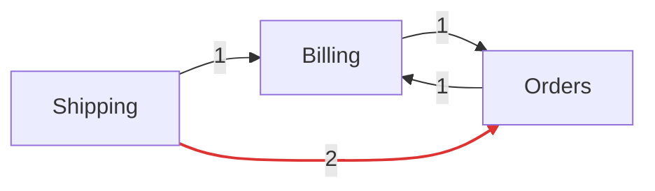

# Living documentation

Generate Markdown documentation of the real architecture, straight from the code:

```bash
php artisan cordon:docs                     # writes docs/architecture/
php artisan cordon:docs --output=docs/modules
```

The output folder (`docs/architecture` by default, relative to the project root) is created if it doesn't exist. Commit it: the diffs show how the architecture changes.

| File | Content |
|---|---|
| `README.md` | Every module with its namespace, dependencies, users and violation count, and a Mermaid diagram of the dependencies. Edge labels count the classes used; edges with internal access are red. |
| `modules/<Module>.md` | A canvas per module: namespace, path, `depends_on`, a diagram of the module and its neighbours, its public API, the classes it uses from other modules and the ones other modules use from it (internal ones flagged), its events and its violations. |
| `events.md` | Every module event with the classes that publish and listen to it. |

GitHub and GitLab render the Mermaid diagrams. The output is deterministic (sorted, no timestamps), so you can commit it and see architecture changes in pull request diffs.



## Events

Events are detected statically:

- classes under a module's `Events` namespace;
- classes dispatched with `event(new X)`, `broadcast(new X)`, `$dispatcher->dispatch(new X)` or `Event::dispatch(new X)`;
- classes registered with `Event::listen(X::class, ...)`.

Publishers also include `X::dispatch()` and listeners include `handle(X $event)` / `__invoke(X $event)`, but only for classes that are already events, because jobs use the same method names.

String event names and wildcard listeners are not detected.

## Violations

The documentation shows every violation, ignoring the baseline: it describes the code as it is.
